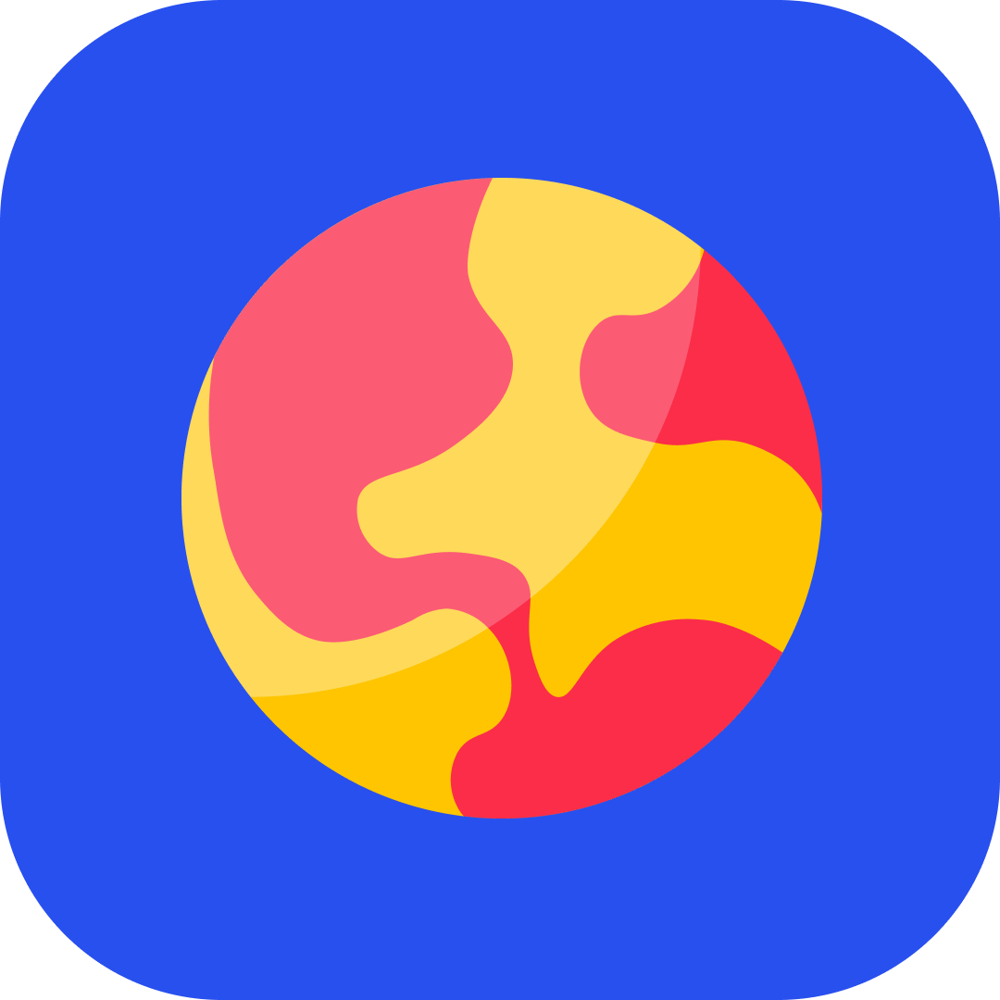

<!-- PROJECT LOGO -->
<br />
<h6 align="center">Carmen Seesink Intro to Android 300</h6>
<p align="center">
</br>
   
  <a href="https://github.com/CarmenSeesink/WorldWise ">
    
  </a>
  
  <h3 align="center">WorldWise</h3>

  <p align="center">
    Let the fun begin
  </p>


<!-- TABLE OF CONTENTS -->
## Table of Contents

* [Project Description](#project-description)
  * [Built with](#built-with)
* [Getting Started](#getting-started)
  * [Prerequisites](#prerequisites)
  * [How to install](#how-to-install)
* [Features and Functionality](#features-and-functionality)
   * [Choose categories](#choosecategories)
   * [Anwser questions](#anwserquestions)
   * [Win or lose](#winorlose)
* [Contributing](#contributing)
* [License](#license)
* [Acknowledgements](#acknowledgements)


<!--PROJECT DESCRIPTION-->
## Project Description

![image1][image1]

Respiratory viruses like the COVID-19, spread when mucus or droplets containing the virus get into your body through your eyes, nose or throat (Sheeran, 2020). Most often, this happens through your hands. Hands are one of the most common ways that the virus spreads from one person to the next (Misra, 2018). During a global pandemic,like the one we are experiencing today, one of the cheapest, easiest, and most important ways to prevent the spread of a virus is to wash your hands frequently with soap and water (Misra, 2018). 

SoapSafe is a Augmented Reality application which aims to inform users of the beneficial effects of proper hand washing. The application educates and motivates while creating an interactive experience.

### Built With

* [Android Studio](https://developer.android.com/studio)

<!-- GETTING STARTED -->
## Getting Started

These instructions will get you a copy of the project up and running on your local machine for development and testing purposes.

### Prerequisites

For development, the latest version of Android Studio is required. 

### How to install
 
1. Clone the repo
```sh
git clone https:://github.com/CarmenSeesink/WorldWise.git
```
2. Open the project

Open and run the project in Android Studio.

<!-- FEATURES AND FUNCTIONALITY-->
## Features and Functionality

![image2][image2]

### Choose categories

Choose between a wide range of categories to increase your world knowledge.

### Anwser questions

Test your knowledge by anwsering fun and interesting questions.

![image3][image3] 

### Win or lose

What will it be?

<!-- CONTRIBUTING -->
## Contributing

Contributions are what make the open source community such an amazing place to be learn, inspire, and create. Any contributions you make are **greatly appreciated**.

1. Fork the Project
2. Create your Feature Branch (`git checkout -b feature/AmazingFeature`)
3. Commit your Changes (`git commit -m 'Add some AmazingFeature'`)
4. Push to the Branch (`git push origin feature/AmazingFeature`)
5. Open a Pull Request

<!-- AUTHORS -->
## Authors

* **Carmen Seesink** - [CarmenSeesink](https://github.com/CarmenSeesink)

<!-- LICENSE -->
## License

Distributed under the MIT License. See `LICENSE` for more information.

<!-- ACKNOWLEDGEMENTS -->
## Acknowledgements

* [CustomListView in Kotlin](https://www.youtube.com/watch?v=95QWxTZG_Z0)

<!-- MARKDOWN LINKS & IMAGES -->
[image1]: Images/1.png
[image2]: Images/2.png
[image3]: Images/3.png


 

 
